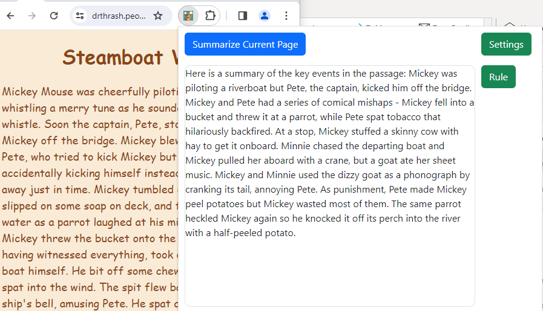

Amazon Bedrock Client for Mac
=============================

Overview
--------

The Amazon Bedrock Summary Client for Chrome is a browser extension that summarizes web pages. It leverages AWS Bedrock, allowing users to quickly understand the contents of a web page.

> **Note**
> Please see the [AWS Bedrock Pricing](https://aws.amazon.com/ko/bedrock/pricing/) page for details and make sure to understand the costs before using the application.

## Main Features

|  	| Features Highlights 	|
|---	|---------------------------------------------------------------------------------	|
| 🌐 	| One-click web page summaries using Claude V2.1	|
| 📝 	| Customization via Regular Expression	|
| 🔒 	| Support for Session token, Secret access key, and access Key from your own AWS account	|
| 🚀 	| Compatible with Chrome 	|

Download
--------

To download the unpacked browser extension, click on the following link:

[Download Amazon Bedrock Summary Client for Chrome](https://github.com/aws-samples/amazon-bedrock-summary-client-for-chrome/releases/latest/download/Amazon.Bedrock.Summary.Client.for.Chrome.zip)

Installation
---------------

### Prerequisites

To use the plugin you will need to generate an access key and secret key pair that has access to Amazon Bedrock with Claude V2.1 enabled within your AWS account.

Go to the [AWS IAM User Guide](https://docs.aws.amazon.com/IAM/latest/UserGuide/id_credentials_access-keys.html) for more details around managing access keys.

Go to the [Amazon Bedrock User Guide](https://docs.aws.amazon.com/bedrock/latest/userguide/model-access.html) for more details around adding model access to your account.

### Steps

#### 1. File preperation
Unzip the latest released plugin

#### 2. Enable developer mode
Open Google Chrome and go to the Extensions page by typing chrome://extensions in the address bar.

Enable Developer mode by clicking the toggle switch in the top right corner of the Extensions page.

#### 3. Installation

Click the "Load unpacked" button on the Extensions page.

In the file browser that pops up, navigate to and select the folder containing the unzipped extension.

The extension should now be installed. You may need to click the puzzle piece icon next to the address bar and pin the extension if it doesn't automatically appear.

#### 4. Configuration

In the top right hand corner of your browser click the new plugin that has appeared. Click the Settings button, paste your access key, secret access key, and optionally session token, click Save.

#### 5. Test

Navigate to whichever page you would like to summarize. Click the extension again and click the Rule button. Paste the following in order to save a rule for this page. Note that each website can have their own rule saved. `
(.*?)<\/p>` is good starting point, but customizing the regex for various web pages will improve the returned summaries.

Troubleshooting
---------------

### 1. Infinite loading
Go to the [Chrome Extensions page](chrome://extensions/), if there is an Errors button next to the amazon-bedrock-summaryclient-for-chrome plug-in, then something went wrong.
This plug-in doesn't support files opened directly in the browser and doesn't support non-https websites.

### 2. Performance optimization
When you configure Provisioned Throughput for a model, you receive a level of throughput at a fixed cost.
Go to the [Amazon Bedrock User Guide](https://docs.aws.amazon.com/bedrock/latest/userguide/prov-throughput.html) for more details.

Build Instructions
------------------

### Prerequisites

npm
git

### Steps

#### 1. Clone the repository

`git clone git@github.com:aws-samples/amazon-bedrock-summary-client-for-chrome.git
cd amazon-bedrock-summary-client-for-chrome`

#### 2. Build Plug-in

`npm install`

`npm run build`

Security
--------

This application was written for demonstration and educational purposes and not for production use. The Security Pillar of the [AWS Well-Architected Framework](https://docs.aws.amazon.com/wellarchitected/latest/security-pillar/welcome.html) can support you in further adopting the sample into a production deployment in addition to your own established processes.

Contributing
------------

1.  Fork the project.
2.  Create your feature branch ( `git checkout -b feature/YourFeature`).
3.  Commit your changes ( `git commit -am 'Add some feature'`).
4.  Push to the branch ( `git push origin feature/YourFeature`).
5.  Open a pull request.

License
-------

This project is licensed under the MIT License - see the [LICENSE](LICENSE) file for details.